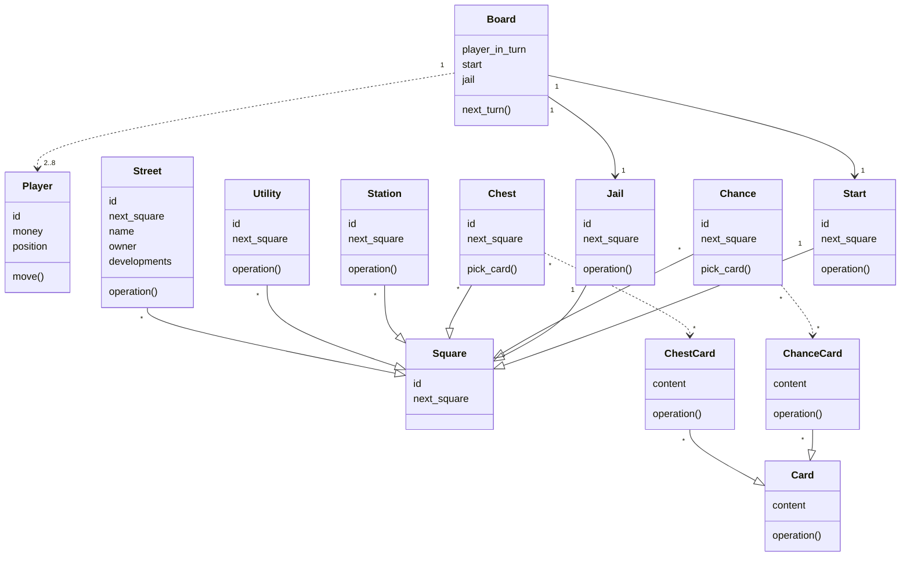

```mermaid
 classDiagram
 Board "1" ..> "2..8" Player
 Start "1" --|> Square
 Jail "1" --|> Square
 Chance "*" --|> Square
 Chest "*" --|> Square
 Station "*" --|> Square
 Utility "*" --|> Square
 Street "*" --|> Square
 Board "1" --> "1" Start
 Board "1" --> "1" Jail
 ChanceCard "*" --|> Card
 ChestCard "*" --|> Card
 Chance "*" ..> "*" ChanceCard
 Chest "*" ..> "*" ChestCard
 class Board{
     player_in_turn
     start
     jail
     next_turn()
 }
 class Player{
     id
     money
     position
     move()
 }
 class Square{
     id
     next_square
 }
 class Start{
     id
     next_square
     operation()
 }
 class Jail{
     id
     next_square
     operation()
 }
 class Chance{
     id
     next_square
     pick_card()
 }
 class Chest{
     id
     next_square
     pick_card()
 }
 class Station{
     id
     next_square
     operation()
 }
 class Utility{
     id
     next_square
     operation()
 }
 class Street{
     id
     next_square
     name
     owner
     developments
     operation()
 }
 class Card{
     content
     operation()
 }
 class ChanceCard{
     content
     operation()
 }
 class ChestCard{
     content
     operation()
 }
```
