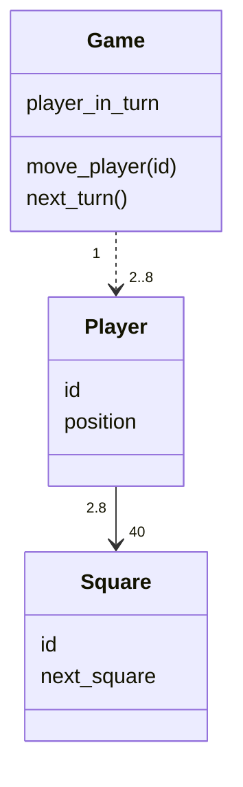

```mermaid
 classDiagram
 Game "1" ..> "2..8" Player
 Player "2.8" --> "40" Square
 class Game{
     player_in_turn
     move_player(id)
     next_turn()
 }
 class Player{
     id
     position
 }
 class Square{
     id
     next_square
 }
```
