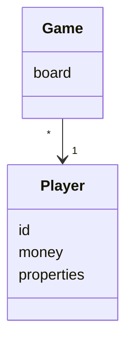
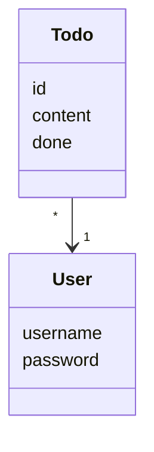

```mermaid
 classDiagram
      Game "*" --> "1" Player
      class Game{
          board
      }
      class Player{
          id
          money
          properties
      }
```

```mermaid
 classDiagram
      Todo "*" --> "1" User
      class User{
          username
          password
      }
      class Todo{
          id
          content
          done
      }
```
